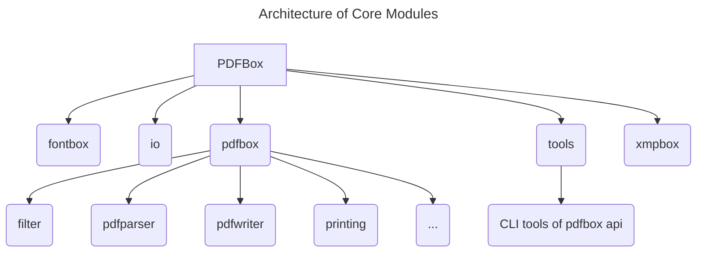
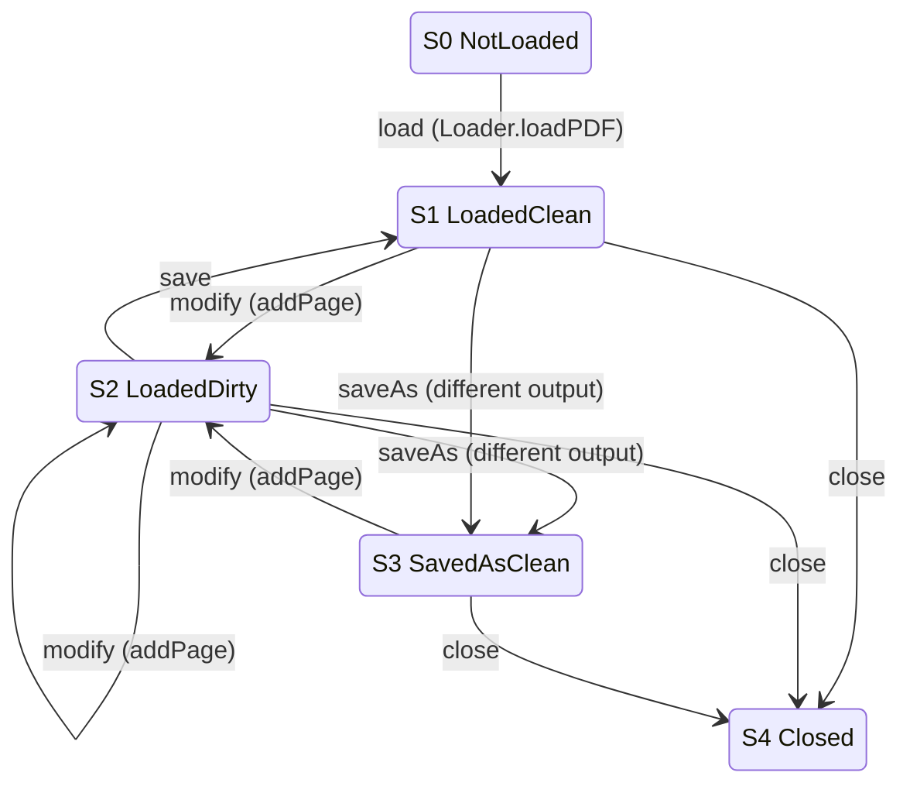

# Software Testing -- PDFBox

----

## 1. Introduction

The PDFBox library is an open source Java tool developed by Apache PDFBox community
for working with PDF documents. This project allows creation
of new PDF documents, manipulation of existing documents and the ability
to extract content from documents. Apache PDFBox also includes several
command-line utilities. In this project, I will do some
systematic functional testing and partition testing on
the key features and functions of PDFBox.

## 2. System Overview

The main features of PDFBox includes Extract Text ,Split & Merge,
Fill Forms ,Preflight ,Print ,Save as Image ,Create PDFs and Signing.

### 2.1 Architecture and Modules

Apache PDFBox is organized as a multi-module Maven project.
The `pdfbox` module provides the core functionality for parsing
and manipulating PDF documents and serves as the primary subject
of testing in this report. Supporting modules such as `fontbox`
and `xmpbox` handle font processing and metadata management,
respectively. Additional modules including `tools` offer command-line
utilities built on top of the core library, while example, benchmarking,
and debugging modules are excluded from the testing scope.



### 2.2 Technology Stack

Apache PDFBox is implemented primarily in Java(more than 99%) and is organized
as a multi-module Maven project. The build and dependency management
are handled through Maven, with a dedicated parent
module (`pdfbox-parent`) defining shared configurations
and dependency versions across all submodules.

The project uses JUnit 5 (`JUnit.Jupiter`) as its testing framework.
All major functional modules, including pdfbox, fontbox, io, xmpbox,
and tools, declare dependencies on `org.junit.jupiter:junit-jupiter`.
This consistent testing setup enables a uniform approach to writing
and executing unit tests across modules.

### 2.3 Project Size and Structure

Based on a repository-wide code analysis using `cloc`,
the project contains over 4,000 source files and approximately
410,000 lines of code, including comments and blank lines.

The implementation is predominantly written in Java, which accounts
for approximately 168,000 lines of executable code, in addition
to supporting resources such as XML configuration files, HTML documentation,
and build metadata. The system is structured into multiple functional modules,
with the pdfbox module serving as the core library for PDF parsing and
document manipulation.

Test code is distributed across several modules and follows
Maven’s conventional directory structure (`/src/test/java`), indicating
an established testing practice within the project. Given the
size and modularity of the system, targeted functional testing is
necessary to achieve meaningful coverage without attempting exhaustive
testing of the entire codebase.

### 2.4 Building & Execution

The project was built and tested locally using Maven 3 from
the repository root. A full clean build and test run was executed with:

`mvn clean test`

The build completed successfully for the entire multi-module
reactor (11 modules) on 2026-02-01. During the build,
Maven Enforcer verified the Java and Maven environment requirements,
Checkstyle was executed with 0 violations.

### 2.5 Existing Test Cases Analysis

PDFBox contains an established automated test suite distributed
across multiple Maven modules under the conventional `src/test/java` layout.
A repository scan indicates 217 Java test classes matching the `*Test*.java` naming pattern.
Test code is primarily concentrated in the core library module
`pdfbox` (122 test classes), with additional coverage in supporting
modules such as `fontbox` (42), `xmpbox` (28), and `io` (10).
Smaller test suites also exist in `tools` (6) and `examples` (9).

The test suite reflects a mix of unit-level and component-level
functional tests. For example, the pdfbox module includes
tests for critical behaviors such as encryption
(`TestPublicKeyEncryption`, `TestSymmetricKeyEncryption`),
as well as utility and correctness checks (`MatrixTest`, `TestHexUtil`, `TestDateUtil`
, `TestNumberFormatUtil`). The presence of tests in
tools (e.g., `TestExtractText`, `TestTextToPdf`, `TestPDFText2HTML`)
indicates validation of command-line wrappers.

The project uses JUnit 5 (JUnit Jupiter) consistently across modules
(managed centrally in the parent configuration). Tests can be
executed from the repository root using Maven 3 (e.g., `mvn clean test`),
which runs the test suites across the full reactor build.
Overall, the distribution and naming conventions suggest a mature testing structure,
while giving chances for additional targeted functional tests
derived from systematic partitioning of inputs for selected features.

## 3 Systematic Functional Testing & Partition Testing

In this project, I chose the Text Extraction as the testing feature.

### 3.1 Motivation for Systematic Functional Testing and Partition Testing

PDF processing software operates on a highly complex and largely
unbounded input space, as PDF documents may vary significantly
in structure, encoding, layout, and validity. Exhaustive testing
of all possible inputs is infeasible. As a result, random or
example-driven testing is insufficient to ensure steady
functional behavior across various possible realistic scenarios.

Systematic functional testing focuses on selecting test inputs
that exercise different observable behaviors, rather than
testing arbitrary examples. Partition testing supports this
by grouping similar inputs together and testing a representative
case from each group, which allows broad functional coverage
with relatively few tests.

This approach is well suited to Apache PDFBox. Although the existing tests
already cover different input conditions.
However, those input categories are not clearly defined and documented.
In this project, partition testing is applied explicitly to the
text extraction functionality to cover both normal and
error-related cases in a controlled and repeatable manner.

### 3.2 Why Text Extraction Was Selected

Text extraction was chosen because it is one of the core
features of PDFBox and is widely used in practice. Even there are
various apps using OCR and AI based technology to do the same work
precise and good. The behavior of text extraction depends
on many properties of the input PDF, such as document structure,
page layout, character encoding, and configuration options.
Different types of PDF files can therefore produce different
observable behaviors.

Text extraction is also easy to test in a controlled way.
Small PDF files can be created or stored as test resources,
and the extracted text can be checked directly. This makes
it suitable for designing clear and repeatable functional
tests, including both normal ca· ses and error cases.

### 3.3 Existing Tests for Text Extraction

PDFBox already contains several tests related to text extraction
defined in `TestTextStripper`. Here is the test cases included:

| Test Case                                                                                          | Test Level / Type                           | Covered Input Partitions                                                                                                        | Limitations                                                                                                      |
|----------------------------------------------------------------------------------------------------|---------------------------------------------|---------------------------------------------------------------------------------------------------------------------------------|------------------------------------------------------------------------------------------------------------------|
| **Extract**:Run text extraction on many PDF files and compare results with known-good text outputs | System-level regression test (golden files) | - Sorting enabled vs disabled<br>- Different input sources (input vs ext directories)<br>- Batch mode vs single-file debug mode | Coverage depends on available PDFs; comparison is tolerant (whitespace and some Unicode differences are ignored) |
| **StripByOutlineItems**: Verify text extraction using outline bookmarks and page ranges            | Component-level functional test             | - Bookmark-based range vs page-based range<br>- Single-page vs multi-page ranges<br>- Orphan bookmark (expect empty output)     | Assumes specific outline structure; does not cover nested or non-page destinations                               |
| **Tabula**: Validate output of a customized `PDFTextStripper` implementation                       | Regression / strategy-variant test          | - Alternative extraction strategy (overridden font height logic)<br>- Specific document input                                   | Internal branches in `computeFontHeight()` are not explicitly covered or asserted                                |
| **StartEndPage**: Extract text from a single specified page                                        | Component-level functional test             | - Single-page range (start = end)<br>- Fixed input document                                                                     | Does not test multi-page, boundary pages, or invalid page ranges                                                 |
| **IgnoreContentStreamSpaceGlyphs**: Verify behavior of ignoring space glyphs in overlapping text   | Option-specific functional test             | - Ignore space glyphs enabled<br>- Overlapping text layout<br>- Sorting enabled                                                 | Does not compare behavior when the option is disabled; relies on exact string match                              |

### 3.4 Partition Design

Based on the principle of partition design, we partition by input features that can alter
observable behavior and design this scheme.

| ID  | Partition Description                                                       | Key Input Characteristics            | Expected Behavior                                                                    | Covered by Existing Tests                                                                    |
|-----|-----------------------------------------------------------------------------|--------------------------------------|--------------------------------------------------------------------------------------|----------------------------------------------------------------------------------------------|
| P1  | Single-page text PDF                                                        | One page, simple ASCII text          | Text is extracted correctly                                                          | Partially (`testExtract`)                                                                    |
| P2  | Multi-page text PDF                                                         | Multiple pages with text             | Text extracted in page order                                                         | Partially (`testExtract`)                                                                    |
| P3  | PDF with Unicode text                                                       | Non-ASCII characters (e.g., Chinese) | Unicode text preserved                                                               | Limited (resource-dependent)                                                                 |
| P4  | Rotated page PDF                                                            | Page rotated (90/270 degrees)        | Text still extracted correctly                                                       | Not explicit                                                                                 |
| P5  | Page range extraction                                                       | Valid start/end page range           | Only selected pages extracted                                                        | Yes (`testStartEndPage`)                                                                     |
| P6  | Outline-based extraction                                                    | Valid outline bookmarks              | Text matches page-range result                                                       | Yes (`testStripByOutlineItems`)                                                              |
| P7  | PDF without extractable text                                                | Image-only or empty content          | Empty or near-empty output                                                           | Not explicit                                                                                 |
| P8  | Encrypted PDF (no permission)                                               | Encrypted, no password               | Extraction fails or throws exception                                                 | Not explicit                                                                                 |
| P9  | `two-columns.pdf` (two-column layout)                                       | New test resource PDF                | Multi-column layout is a classic case where `sortByPosition` changes reading order   | `testExtract()` runs sort on/off, but does not isolate ordering differences in a minimal way |
| P10 | Runtime-generated PDF with invalid page range (start > end / out of bounds) | Generated at runtime                 | Boundary/invalid input: verifies failure mode or defined behavior for invalid ranges | Existing tests only cover one valid single-page range                                        |
| P11 | Encrypted PDF with wrong password                                           | Generated at runtime                 | Different from “no password”: verifies error handling on wrong credentials           | Not explicitly covered in `TestTextStripper`                                                 |

The input space of text extraction is divided into a set of partitions
based on document structure, content type, configuration, and error
conditions. Some of these partitions are already covered by existing
tests, while others are only partially covered or not covered at all.
This partition scheme is used to guide the selection of representative
test cases in the next step.

### 3.5 Representative Inputs I Selected

This section only includes representative inputs that are not already well
covered by the existing test suite. Basic cases such as single-page,
multi-pages, and general Unicode text extraction are excluded,
as they are already exercised by the existing regression test. To make testing
visible, we use pre-generated fixed inputs PDF.

| Partition ID | Representative Input (Selected by Me)                                             | Why This Input Is Representative                                                                                  |
|--------------|-----------------------------------------------------------------------------------|-------------------------------------------------------------------------------------------------------------------|
| P4           | `rotated-page.pdf` (one page rotated 90° or 270° with simple text)                | A minimal rotated-page PDF isolates rotation as the only variable and checks rotation-related extraction behavior |
| P7           | `image-only.pdf` (image-only, no text objects)                                    | Represents a valid PDF where text extraction should return empty (or near-empty) output                           |
| P8           | Runtime-generated encrypted PDF (no password provided)                            | Represents the failure mode when encrypted content cannot be accessed without credentials                         |
| P9           | `two-columns.pdf` (two columns with clear left-to-right / top-to-bottom ordering) | Isolates a classic reading-order case where `setSortByPosition(true/false)` should produce different text order   |
| P10          | Runtime-generated multi-page PDF + invalid ranges (start>end and out-of-bounds)   | Provides controlled boundary inputs to verify the defined failure/handling behavior of invalid page ranges        |
| P11          | Runtime-generated encrypted PDF + wrong password                                  | Separates “wrong password” from “no password” and verifies consistent error handling for invalid credentials      |

### 3.6 Mapping Inputs to JUnit Tests

| New Test Method                                      | Partition | Test Input PDF                  | Main Assertion (What to Verify)                                      | Notes                                     |
|------------------------------------------------------|-----------|---------------------------------|----------------------------------------------------------------------|-------------------------------------------|
| `testExtractText_rotatedPage()`                      | P4        | `rotated-page-90.pdf`           | Extracted text contains `ROTATED_90` (normalize whitespace)          | Use `contains()`; avoid full string match |
| `testExtractText_imageOnly_returnsEmpty()`           | P7        | `image-only.pdf`                | `extracted.trim()` is empty (or very small)                          | Ensure PDF truly has no text layer        |
| `testExtractText_encrypted_noPassword_throws()`      | P8        | `encrypted-userpass-secret.pdf` | Extraction fails without password (assert throws)                    | Assert exception type if stable           |
| `testExtractText_twoColumns_sortingChangesOrder()`   | P9        | `two-columns.pdf`               | Output differs for sort on/off; sorted output matches expected order | Design obvious c1 then c2 ordering        |
| `testExtractText_invalidRange_startGreaterThanEnd()` | P10       | `multi-page-3.pdf`              | Defined behavior for start>end (throws or empty)                     | Run once to observe, then lock behavior   |
| `testExtractText_invalidRange_outOfBounds()`         | P10       | `multi-page-3.pdf`              | Defined behavior for out-of-bounds (throws or clamp/empty)           | Same approach: observe then lock          |
| `testExtractText_encrypted_wrongPassword_throws()`   | P11       | `encrypted-userpass-secret.pdf` | Extraction fails with wrong password (assert throws)                 | Separate from no-password case            |

Run `mvn -pl pdfbox -Dtest=TestTextExtractionPartitions test
` All Junit Tests passed;

```xml

<testcase name="testExtractText_invalidRange_outOfBounds"
          classname="org.apache.pdfbox.text.TestTextExtractionPartitions" time="0.299"/>
<testcase name="testExtractText_imageOnly_returnsEmpty" classname="org.apache.pdfbox.text.TestTextExtractionPartitions"
          time="0.016"/>
<testcase name="testExtractText_encrypted_noPassword_throws"
          classname="org.apache.pdfbox.text.TestTextExtractionPartitions" time="0.013"/>
<testcase name="testExtractText_invalidRange_startGreaterThanEnd"
          classname="org.apache.pdfbox.text.TestTextExtractionPartitions" time="0.001"/>
<testcase name="testExtractText_encrypted_wrongPassword_throws"
          classname="org.apache.pdfbox.text.TestTextExtractionPartitions" time="0.002"/>
<testcase name="testExtractText_twoColumns_sortingChangesOrder"
          classname="org.apache.pdfbox.text.TestTextExtractionPartitions" time="0.097"/>
<testcase name="testExtractText_rotatedPage" classname="org.apache.pdfbox.text.TestTextExtractionPartitions"
          time="0.437">
-------------------------------------------------------------------------------
Test set: org.apache.pdfbox.text.TestTextExtractionPartitions
-------------------------------------------------------------------------------
Tests run: 7, Failures: 0, Errors: 0, Skipped: 0, Time elapsed: 0.878 s -- in
org.apache.pdfbox.text.TestTextExtractionPartitions
</testcase>
```

### 3.7 Results and Observations

All newly added JUnit tests passed successfully on the current version of Apache PDFBox.
The results confirm that PDFTextStripper behaves consistently across the selected
input partitions.

For rotated-page PDFs (P4), text extraction succeeds and returns the expected content,
indicating that page rotation does not prevent correct text extraction.

For image-only PDFs (P7), the extractor returns empty or near-empty output,
which matches the expected behavior when no text objects exist.

Encrypted PDFs without a password or with a wrong password (P8, P11) consistently
fail during loading or extraction, demonstrating stable error handling for
protected documents.

For two-column layouts (P9), enabling sortByPosition changes the reading order,
and the sorted output follows the expected left-to-right column order.

Invalid page range inputs (P10) result in empty output, which defines the current behavior of PDFTextStripper for such
boundary conditions.

Overall, the observed behaviors match the expected outcomes defined for each partition.

## 4 Finite Functional Model in SW-Testing

### 4.1 Why Finite Model

A finite model is an abstract way to describe system behavior
using a limited number of states and transitions. In this course,
the most common form is a Finite State Machine (FSM), which represents
states as nodes and transitions as directed edges. Even though a real
program may have many internal configurations, an FSM captures only
the important behavioral states needed for analysis.

Finite models are useful for testing because they make the specification
clearer and more structured. Instead of relying only on natural-language
descriptions, the model explicitly shows:

- What states are allowed
- What transitions are valid
- How the system should react to events

This helps reduce ambiguity and makes expected behavior easier to verify. And
most important one, it helps us organize test cases.

Another advantage is that finite models guide test design.
Each state and each transition can become a test target. By checking whether
all states and transitions have been exercised, we obtain a clear
testing criterion rather than guessing when testing is “enough.”

In our PDFBox project, many components are relatively simple and do
not involve complex state changes. However, some features involve
multiple stages of processing and different behavioral modes. For example,
certain operations depend on whether a document is loaded, modified,
saved, or closed. These situations naturally form distinct states with different
allowed operations. Modeling such features using an FSM makes it easier
to clearly define valid transitions and identify invalid sequences.
This structure helps us systematically derive test cases that cover
meaningful state changes rather than only individual method calls.

### 4.2 Document Lifecycle as an FSM

Many components in PDFBox are implemented as individual API operations
that perform specific tasks without forming complex state-driven behavior.
As a result, not all features naturally lend themselves to finite state modeling.

However, the lifecycle of a PDF document session exhibits clear state-dependent
constraints. Operations such as loading a document, modifying its content,
saving it (including saving to a different output destination), and closing
it must follow a meaningful order. The validity and effect of each operation
depend on the current stage of the document. For example, a document must be
loaded before it can be modified or saved, and once it is closed, further
operations should no longer be valid.

Because the behavior of this feature depends on operation sequences and
implicit usage rules, the document lifecycle is well suited to be abstracted
as a finite state machine. This abstraction captures the allowed transitions
between stages and provides a structured representation of the feature’s behavior.

### 4.3 FSM

We model the PDF document session lifecycle in PDFBox as a finite state machine (FSM),
where each node represents an abstract document state and each directed edge represents
an API operation that causes a state transition. This model is an abstraction of
many concrete program configurations into a small set of meaningful lifecycle stages.



The FSM contains five states: NotLoaded, LoadedClean, LoadedDirty, SavedAsClean,
and Closed. A successful `Loader.loadPDF(...)` transition moves the system
from NotLoaded to LoadedClean. Calling `addPage(new PDPage())` represents a
modification and transitions the document to LoadedDirty, where additional
modifications keep it in the same state.

From LoadedDirty, saving returns the document to a clean state (LoadedClean).
Saving to a different output destination (abstracted as “saveAs”) transitions
the document to SavedAsClean. From SavedAsClean, another modification
returns the document to the dirty state. The `close()` operation transitions
the document from any active state to Closed, after which further
operations are treated as invalid usage.

This FSM makes the allowed operation sequences explicit and highlights
invalid sequences (such as performing save or modify after close).
It provides a compact behavioral specification of the lifecycle and
a clear structure for systematic testing based on states and transitions.

### 4.4 Testing

run```mvn -pl pdfbox -Dtest=TestPDDocumentLifecycleFSM test```
src is
in <https://github.com/burgger/pdfbox-SWtesting/blob/trunk/pdfbox/src/test/java/org/apache/pdfbox/pdmodel/TestPDDocumentLifecycleFSM.java>

Test cases:

| Test ID                       | FSM Coverage (States/Transitions)                              | Steps                                                                        | Expected Result                                              |
|-------------------------------|----------------------------------------------------------------|------------------------------------------------------------------------------|--------------------------------------------------------------|
| T1 Load→Close                 | NotLoaded→LoadedClean, LoadedClean→Closed                      | `loadPDF(fixture)` then `close()`                                            | Load succeeds; page count = 1; close succeeds (no exception) |
| T2 Load→Modify→Save→Close     | LoadedClean→LoadedDirty, LoadedDirty→LoadedClean, →Closed      | load → `addPage` → `save(out)` → close → reload(out)                         | Reload succeeds; page count becomes 2                        |
| T3 Dirty self-loop            | LoadedDirty→LoadedDirty (modify), then LoadedDirty→LoadedClean | load → `addPage` → `addPage` → `save(out)` → reload(out)                     | Reload succeeds; page count becomes 3                        |
| T4 Clean save self-loop       | LoadedClean→LoadedClean (save)                                 | load → `save(out)` (no modify) → reload(out)                                 | Reload succeeds; page count remains 1                        |
| T5 saveAs from clean          | LoadedClean→SavedAsClean (abstract)                            | load → `save(outA)` → `save(outB)` → reload(outB)                            | Reload succeeds; page count remains 1                        |
| T6 saveAs from dirty          | LoadedDirty→SavedAsClean (abstract)                            | load → `save(outA)` → `addPage` → `save(outB)` → reload(outB)                | Reload succeeds; page count becomes 2                        |
| T7 After saveAs modify/save   | SavedAsClean→LoadedDirty, LoadedDirty→LoadedClean              | load → `save(outA)` → `save(outB)` → `addPage` → `save(outC)` → reload(outC) | Reload succeeds; page count becomes 2                        |
| T8 Invalid save after close   | Closed + `save` (invalid transition)                           | load → close → `save(out)`                                                   | Save should not succeed (exception)                          |
| T9 Invalid modify after close | Closed + `modify` (invalid transition)                         | load → close → `addPage`                                                     | not successfully produce a valid saved PDF(exception)        |

We ran 9 FSM-derived JUnit 5 tests on `two-columns.pdf` (1 page).
All tests passed. The suite covers the main lifecycle operations
load → modify (addPage) → save / saveAs → close, using
reload-and-page-count checks as the oracle. For invalid
usage after `close()`, we verified that post-close operations
cannot successfully produce a valid saved PDF. Outputs
are written to `target/test-output/fsm-test`.

## 5 Structural Testing

### 5.1 What & Why

Structural testing, also known as white-box testing, evaluates a test suite by
looking at the internal structure of the program rather than only its external
specification.
Instead of focusing only on the specification, it examines
the code itself. Functional testing is based on intended behavior,
while structural testing is based on how the program is actually implemented (Code).

Structural testing relies on the Control Flow Graph (CFG). In a CFG, nodes represent
basic blocks, and edges represent possible control flow between them. Using
this model, we can see which parts of the code are executed by our tests.

Two common coverage criteria are statement coverage and branch coverage.
Statement coverage requires that every executable statement be executed
at least once. Branch coverage requires that every branch be taken at least once.

And to measure coverage we use instrumentation. Instrumentation inserts probes into
the program and records whether statements or branches are executed.For our
PDFBox project, structural testing is practical because PDF handling code has many internal
branches. A PDF file can be valid or invalid. It can use different encode methods, filters,
and object types. PDFBox often chooses different running paths based on these cases.
Branch coverage can show which of these paths never run in our current tests.
This tells us what is missing. Then we can add the missing tests, such as tests
that trigger error-handling branches (malformed input), uncommon parsing branches,
or early-exit/exception exits in methods. This is hard to see from the API
behavior alone, but it becomes clear when we look at CFG
branches and coverage results.

### 5.2 Baseline Structural Coverage

At the project level, JaCoCo
(<https://github.com/burgger/pdfbox-SWtesting/blob/trunk/jacoco%20Baseline/index.html>)
reports 62% instruction coverage(68,767 missed out of 182,134
total instructions) and 53% branch coverage (7,615 missed out of
16,363 total branches). The project has 39,064 total lines, with 15,399
lines missed (about 61% line coverage). It also has 7,058 total methods,
with 3,051 methods missed (about 57% method coverage).

This baseline shows that many branches and methods are still not
executed by tests. In particular, recovery paths and error-handling
code are likely to be missed, because normal tests mostly use
well-formed PDFs and common workflows.

https://github.com/burgger/pdfbox-SWtesting/blob/trunk/jacoco%20Baseline/org.apache.pdfbox.pdfparser/BruteForceParser.java.html

### 5.3 Testing

#### 5.3.1 BruteForceParser

We selected `org.apache.pdfbox.pdfparser.BruteForceParser`as our testing target based on structural coverage 
analysis from the JaCoCo baseline report.
The class had 53<https://github.com/burgger/pdfbox-SWtesting/blob/trunk/jacoco%20Baseline/org.apache.pdfbox.pdfparser/BruteForceParser.html> 
uncovered lines, closely matching our requirement to
supplement at least 50 lines of new coverage. More importantly, the uncovered 
code was concentrated in a few core methods (e.g., `bfSearchForXRefStreams()`,
`bfSearchForXRef(long)`, and `compareCOSObjects(...)`) that implement recovery
logic for malformed PDFs. These branches are deterministic and can be triggered
by carefully constructed byte-level PDF inputs, making them significantly more 
controllable than rendering, font, or annotation subsystems. From a testing 
strategy perspective, this class offered the best trade-off between impact
(high uncovered density), feasibility (limited external dependencies),
and precision (clear input–path mapping).

#### 5.3.2 Added Tests

We added a new JUnit test class `org.apache.pdfbox.pdfparser.TestStructuralParser`
<https://github.com/burgger/pdfbox-SWtesting/blob/trunk/pdfbox/src/test/java/org/apache/pdfbox/pdfparser/TestStructuralParser.java>
with three targeted tests to improve structural coverage in the PDF
parsing recovery logic.

1. `testBruteForce()`

    - What it does: This test forces brute-force recovery during parsing by giving the loader a PDF whose startxref
      points to an invalid offset, so the normal xref lookup fails and PDFBox falls back to BruteForceParser. The goal
      is specifically to execute the xref-stream recovery scan logic.

    - `BruteForce.pdf` contains(in PDF structure):
        - A valid-looking set of objects (`1 0 obj` Catalog, `2 0 obj` Pages, `3 0 obj` Page, etc.)
        - A special object containing `<< /Type /XRef ... >>` (so the byte sequence "/XRef" exists in the file)
        - `startxref 123456`, which points beyond the file end, meaning the parser cannot jump to a real xref
          table/stream and must attempt recovery by scanning bytes
    - This makes `BruteForceParser` search for "`/XRef`" in the raw bytes and then scan backwards to find the nearest
      matching "` obj`" header with digits, to “fix” the xref-stream reference.
    - Cover Lines:
      L672-731<https://github.com/burgger/pdfbox-SWtesting/blob/7268eb149aa7f78116d6cf794a121f89ddbfc03b/pdfbox/src/main/java/org/apache/pdfbox/pdfparser/BruteForceParser.java#L672>


2. `test_bfSearchForXRef_chooseStreamWhenCloser_and_chooseTableWhenCloser()`

    - What it does: This test targets the decision branch in `bfSearchForXRef(long xrefOffset)` when BOTH candidates
      exist:

        - a candidate xref table offset (`xref`)

        - a candidate xref stream offset (detected via `/XRef`)

    - Then it forces the code to choose the nearer one by calling `bfSearchForXRef()` twice with different "target"
      offsets.
    - Cover Lines:
      L233-258<https://github.com/burgger/pdfbox-SWtesting/blob/7268eb149aa7f78116d6cf794a121f89ddbfc03b/pdfbox/src/main/java/org/apache/pdfbox/pdfparser/BruteForceParser.java#L233>


3. `test_compareCOSObjects_sameNumberDifferentGeneration_hitsTernaryBranch()`

    - What it does: This test uses reflection to invoke the private method `compareCOSObjects(...)` with two
      `COSObjects` that share the same object number but different generation numbers. The intent is to execute the
      ternary branch that prefers the higher generation when object numbers match.

    - Cover Lines: L498-507<https://github.com/burgger/pdfbox-SWtesting/blob/7268eb149aa7f78116d6cf794a121f89ddbfc03b/pdfbox/src/main/java/org/apache/pdfbox/pdfparser/BruteForceParser.java#L498>

### 5.4 Conclusion

| Scope                 | Metric                            | Baseline | Modified | Improvement |
|-----------------------|-----------------------------------|----------|----------|-------------|
| **BruteForceParser**  | Instruction Coverage              | 86%      | 98%      | +12%        |
| **BruteForceParser**  | Branch Coverage                   | 69%      | 82%      | +13%        |
| **BruteForceParser**  | Missed Lines                      | 53       | 8        | −45 lines   |
| **BruteForceParser**  | `bfSearchForXRef(long)` Instr.    | 49%      | 100%     | +51%        |
| **BruteForceParser**  | `bfSearchForXRefStreams()` Instr. | 14%      | 100%     | +86%        |
| **pdfparser package** | Instruction Coverage              | 82%      | 88%      | +6%         |
| **pdfparser package** | Branch Coverage                   | 69%      | 74%      | +5%         |
| **Total**             | Missed Lines                      | 15399    | 15343    | -56 lines   |


## 6 Continuous Integration

### 6.1 Definition
Integration refers to the process of combining two or more software components into
a working system. Even if individual components function correctly in isolation,
new defects may appear when they interact. Poor integration can lead to cascading
failures, making debugging difficult and time-consuming.

Continuous Integration (CI) is a development practice in which developers frequently
integrate their code changes into a shared repository, often multiple times per day.
Each integration is automatically verified by building the system and running automated tests.
The goal is to detect problems as early as possible.

The primary purposes of Continuous Integration are:

- **Early bug detection** – Smaller changes make it easier to identify and fix defects.

- **Preventing defect accumulation** – Bugs are discovered independently rather than 
interacting with one another.

- **Maintaining a stable main branch** – The main development line should always build successfully.

- **Rapid feedback** – Developers receive immediate information about whether their
changes break the system.

- **Supporting frequent deployment** – CI enables faster release cycles and continuous improvement.

In practice, CI works by automatically triggering a build and test process whenever
new code is committed to the repository. If the build or tests fail, the developer
responsible must fix the issue immediately. This ensures that the codebase remains
stable and continuously deployable.

In this project, we implement CI using GitHub Actions to automatically
build the PDFBox system and execute our test suite on every commit.

### 6.2 Existing GitHub Actions

The original PDFBox fork repository already contains a GitHub Actions workflow
named CodeQL under `.github/workflows/codeql-analysis.yml`.

This workflow is triggered on pushes and pull requests to the trunk branch.
Its primary purpose is to perform static code analysis using GitHub’s CodeQL tool.
The workflow:

- Checks out the repository

- Caches the local Maven dependencies

- Compiles the project using Maven (with tests skipped)

- Executes CodeQL security and quality analysis

CodeQL is a static analysis tool provided by GitHub that automatically scans source
code for potential security vulnerabilities and code quality issues. Unlike traditional
CI pipelines that build and run test cases, CodeQL analyzes the code structure
without executing the program.

The workflow builds the source code to enable static analysis, but it does not execute
the project's test suite, as tests are explicitly skipped during compilation (`-DskipTests)`.

### 6.3 CI Using GitHub Actions

Our task is to create a configuration file to **build** and **test** your project.

So we created a new workflow file under `.github/workflows/CI-build-test.yml`. It is triggered on:

- ```push``` to the `trunk` branch

- ```pull_request``` targeting the `trunk` branch
