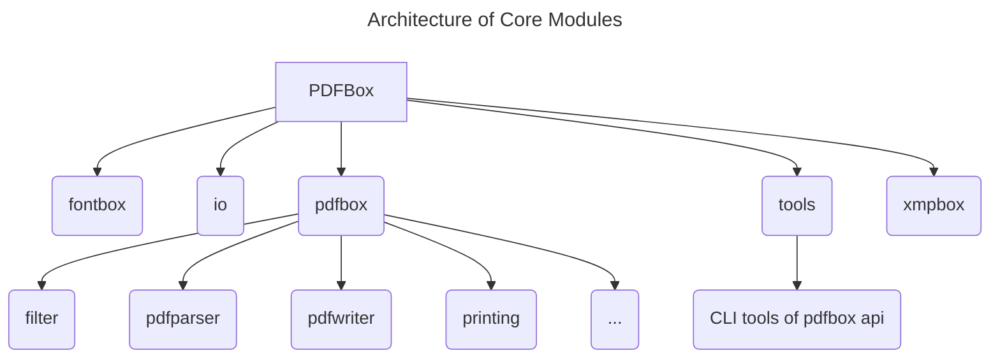

# Software Testing -- PDFBox

----

## 1. Introduction
The PDFBox library is an open source Java tool developed by Apache PDFBox community
for working with PDF documents. This project allows creation
of new PDF documents, manipulation of existing documents and the ability
to extract content from documents. Apache PDFBox also includes several
command-line utilities. In this project, I will do some
systematic functional testing and partition testing on 
the key features and functions of PDFBox.

## 2. System Overview
The main features of PDFBox includes Extract Text ,Split & Merge,
Fill Forms ,Preflight ,Print ,Save as Image ,Create PDFs and Signing.

### 2.1 Architecture and Modules
Apache PDFBox is organized as a multi-module Maven project. 
The `pdfbox` module provides the core functionality for parsing 
and manipulating PDF documents and serves as the primary subject 
of testing in this report. Supporting modules such as `fontbox`
and `xmpbox` handle font processing and metadata management,
respectively. Additional modules including `tools` offer command-line
utilities built on top of the core library, while example, benchmarking,
and debugging modules are excluded from the testing scope.

### 2.2 Technology Stack
Apache PDFBox is implemented primarily in Java(more than 99%) and is organized 
as a multi-module Maven project. The build and dependency management
are handled through Maven, with a dedicated parent 
module (`pdfbox-parent`) defining shared configurations
and dependency versions across all submodules.

The project uses JUnit 5 (`JUnit.Jupiter`) as its testing framework.
All major functional modules, including pdfbox, fontbox, io, xmpbox,
and tools, declare dependencies on `org.junit.jupiter:junit-jupiter`.
This consistent testing setup enables a uniform approach to writing
and executing unit tests across modules.

### 2.3 Project Size and Structure

Based on a repository-wide code analysis using `cloc`, 
the project contains over 4,000 source files and approximately
410,000 lines of code, including comments and blank lines.

The implementation is predominantly written in Java, which accounts
for approximately 168,000 lines of executable code, in addition 
to supporting resources such as XML configuration files, HTML documentation,
and build metadata. The system is structured into multiple functional modules,
with the pdfbox module serving as the core library for PDF parsing and 
document manipulation.

Test code is distributed across several modules and follows
Maven’s conventional directory structure (`/src/test/java`), indicating
an established testing practice within the project. Given the 
size and modularity of the system, targeted functional testing is
necessary to achieve meaningful coverage without attempting exhaustive
testing of the entire codebase.

### 2.4 Building & Execution

The project was built and tested locally using Maven 3 from
the repository root. A full clean build and test run was executed with:

`mvn clean test`

The build completed successfully for the entire multi-module 
reactor (11 modules) on 2026-02-01. During the build, 
Maven Enforcer verified the Java and Maven environment requirements,
Checkstyle was executed with 0 violations.

### 2.5 Existing Test Cases Analysis
PDFBox contains an established automated test suite distributed
across multiple Maven modules under the conventional `src/test/java` layout. 
A repository scan indicates 217 Java test classes matching the `*Test*.java` naming pattern.
Test code is primarily concentrated in the core library module
`pdfbox` (122 test classes), with additional coverage in supporting 
modules such as `fontbox` (42), `xmpbox` (28), and `io` (10). 
Smaller test suites also exist in `tools` (6) and `examples` (9).

The test suite reflects a mix of unit-level and component-level
functional tests. For example, the pdfbox module includes
tests for critical behaviors such as encryption
(`TestPublicKeyEncryption`, `TestSymmetricKeyEncryption`), 
as well as utility and correctness checks (`MatrixTest`, `TestHexUtil`, `TestDateUtil`
, `TestNumberFormatUtil`). The presence of tests in
tools (e.g., `TestExtractText`, `TestTextToPdf`, `TestPDFText2HTML`) 
indicates validation of command-line wrappers.

The project uses JUnit 5 (JUnit Jupiter) consistently across modules
(managed centrally in the parent configuration). Tests can be
executed from the repository root using Maven 3 (e.g., `mvn clean test`),
which runs the test suites across the full reactor build.
Overall, the distribution and naming conventions suggest a mature testing structure,
while giving chances for additional targeted functional tests
derived from systematic partitioning of inputs for selected features.

## 3 Systematic Functional Testing & Partition Testing
In this project, I chose the Text Extraction as the testing feature.

### 3.1 Motivation for Systematic Functional Testing and Partition Testing
PDF processing software operates on a highly complex and largely
unbounded input space, as PDF documents may vary significantly
in structure, encoding, layout, and validity. Exhaustive testing
of all possible inputs is infeasible. As a result, random or
example-driven testing is insufficient to ensure steady
functional behavior across various possible realistic scenarios.

Systematic functional testing focuses on selecting test inputs
that exercise different observable behaviors, rather than
testing arbitrary examples. Partition testing supports this 
by grouping similar inputs together and testing a representative
case from each group, which allows broad functional coverage
with relatively few tests.

This approach is well suited to Apache PDFBox. Although the existing tests 
already cover different input conditions.
However, those input categories are not clearly defined and documented.
In this project, partition testing is applied explicitly to the
text extraction functionality to cover both normal and
error-related cases in a controlled and repeatable manner.

### 3.2 Why Text Extraction Was Selected

Text extraction was chosen because it is one of the core
features of PDFBox and is widely used in practice. Even there are
various apps using OCR and AI based technology to do the same work
precise and good. The behavior of text extraction depends
on many properties of the input PDF, such as document structure, 
page layout, character encoding, and configuration options.
Different types of PDF files can therefore produce different
observable behaviors.

Text extraction is also easy to test in a controlled way.
Small PDF files can be created or stored as test resources,
and the extracted text can be checked directly. This makes 
it suitable for designing clear and repeatable functional
tests, including both normal ca·                    ses and error cases.

### 3.3 Existing Tests for Text Extraction
PDFBox already contains several tests related to text extraction 
defined in `TestTextStripper`. Here is the test cases included:

| Test Case                                                                                          | Test Level / Type                           | Covered Input Partitions                                                                                                        | Limitations                                                                                                      |
|----------------------------------------------------------------------------------------------------|---------------------------------------------|---------------------------------------------------------------------------------------------------------------------------------|------------------------------------------------------------------------------------------------------------------|
| **Extract**:Run text extraction on many PDF files and compare results with known-good text outputs | System-level regression test (golden files) | - Sorting enabled vs disabled<br>- Different input sources (input vs ext directories)<br>- Batch mode vs single-file debug mode | Coverage depends on available PDFs; comparison is tolerant (whitespace and some Unicode differences are ignored) |
| **StripByOutlineItems**: Verify text extraction using outline bookmarks and page ranges            | Component-level functional test             | - Bookmark-based range vs page-based range<br>- Single-page vs multi-page ranges<br>- Orphan bookmark (expect empty output)     | Assumes specific outline structure; does not cover nested or non-page destinations                               |
| **Tabula**: Validate output of a customized `PDFTextStripper` implementation                       | Regression / strategy-variant test          | - Alternative extraction strategy (overridden font height logic)<br>- Specific document input                                   | Internal branches in `computeFontHeight()` are not explicitly covered or asserted                                |
| **StartEndPage**: Extract text from a single specified page                                        | Component-level functional test             | - Single-page range (start = end)<br>- Fixed input document                                                                     | Does not test multi-page, boundary pages, or invalid page ranges                                                 |
| **IgnoreContentStreamSpaceGlyphs**: Verify behavior of ignoring space glyphs in overlapping text   | Option-specific functional test             | - Ignore space glyphs enabled<br>- Overlapping text layout<br>- Sorting enabled                                                 | Does not compare behavior when the option is disabled; relies on exact string match                              |

### 3.4 Partition Design
Based on the principle of partition design, we partition by input features that can alter
observable behavior and design this scheme.

| ID  | Partition Description                                                       | Key Input Characteristics            | Expected Behavior                                                                     | Covered by Existing Tests                                                                    |
|-----|-----------------------------------------------------------------------------|--------------------------------------|---------------------------------------------------------------------------------------|----------------------------------------------------------------------------------------------|
| P1  | Single-page text PDF                                                        | One page, simple ASCII text          | Text is extracted correctly                                                           | Partially (`testExtract`)                                                                    |
| P2  | Multi-page text PDF                                                         | Multiple pages with text             | Text extracted in page order                                                          | Partially (`testExtract`)                                                                    |
| P3  | PDF with Unicode text                                                       | Non-ASCII characters (e.g., Chinese) | Unicode text preserved                                                                | Limited (resource-dependent)                                                                 |
| P4  | Rotated page PDF                                                            | Page rotated (90/270 degrees)        | Text still extracted correctly                                                        | Not explicit                                                                                 |
| P5  | Page range extraction                                                       | Valid start/end page range           | Only selected pages extracted                                                         | Yes (`testStartEndPage`)                                                                     |
| P6  | Outline-based extraction                                                    | Valid outline bookmarks              | Text matches page-range result                                                        | Yes (`testStripByOutlineItems`)                                                              |
| P7  | PDF without extractable text                                                | Image-only or empty content          | Empty or near-empty output                                                            | Not explicit                                                                                 |
| P8  | Encrypted PDF (no permission)                                               | Encrypted, no password               | Extraction fails or throws exception                                                  | Not explicit                                                                                 |
| P9  | `two-columns.pdf` (two-column layout)                                       | New test resource PDF                | Multi-column layout is a classic case where `sortByPosition` changes reading order    | `testExtract()` runs sort on/off, but does not isolate ordering differences in a minimal way |
| P10 | Runtime-generated PDF with invalid page range (start > end / out of bounds) | Generated at runtime                 | Boundary/invalid input: verifies failure mode or defined behavior for invalid ranges  | Existing tests only cover one valid single-page range                                        |
| P11 | Encrypted PDF with wrong password                                           | Generated at runtime                 | Different from “no password”: verifies error handling on wrong credentials            | Not explicitly covered in `TestTextStripper`                                                 |

The input space of text extraction is divided into a set of partitions
based on document structure, content type, configuration, and error
conditions. Some of these partitions are already covered by existing
tests, while others are only partially covered or not covered at all. 
This partition scheme is used to guide the selection of representative
test cases in the next step.

### 3.5 Representative Inputs I Selected
This section only includes representative inputs that are not already well
covered by the existing test suite. Basic cases such as single-page,
multi-pages, and general Unicode text extraction are excluded, 
as they are already exercised by the existing regression test. To make testing
visible, we use pre-generated fixed inputs PDF.

| Partition ID | Representative Input (Selected by Me)                                             | Why This Input Is Representative                                                                                  |
|--------------|-----------------------------------------------------------------------------------|-------------------------------------------------------------------------------------------------------------------|
| P4           | `rotated-page.pdf` (one page rotated 90° or 270° with simple text)                | A minimal rotated-page PDF isolates rotation as the only variable and checks rotation-related extraction behavior |
| P7           | `image-only.pdf` (image-only, no text objects)                                    | Represents a valid PDF where text extraction should return empty (or near-empty) output                           |
| P8           | Runtime-generated encrypted PDF (no password provided)                            | Represents the failure mode when encrypted content cannot be accessed without credentials                         |
| P9           | `two-columns.pdf` (two columns with clear left-to-right / top-to-bottom ordering) | Isolates a classic reading-order case where `setSortByPosition(true/false)` should produce different text order   |
| P10          | Runtime-generated multi-page PDF + invalid ranges (start>end and out-of-bounds)   | Provides controlled boundary inputs to verify the defined failure/handling behavior of invalid page ranges        |
| P11          | Runtime-generated encrypted PDF + wrong password                                  | Separates “wrong password” from “no password” and verifies consistent error handling for invalid credentials      |


### 3.6 Mapping Inputs to JUnit Tests

| New Test Method                                      | Partition | Test Input PDF                  | Main Assertion (What to Verify)                                      | Notes                                     |
|------------------------------------------------------|-----------|---------------------------------|----------------------------------------------------------------------|-------------------------------------------|
| `testExtractText_rotatedPage()`                      | P4        | `rotated-page-90.pdf`           | Extracted text contains `ROTATED_90` (normalize whitespace)          | Use `contains()`; avoid full string match |
| `testExtractText_imageOnly_returnsEmpty()`           | P7        | `image-only.pdf`                | `extracted.trim()` is empty (or very small)                          | Ensure PDF truly has no text layer        |
| `testExtractText_encrypted_noPassword_throws()`      | P8        | `encrypted-userpass-secret.pdf` | Extraction fails without password (assert throws)                    | Assert exception type if stable           |
| `testExtractText_twoColumns_sortingChangesOrder()`   | P9        | `two-columns.pdf`               | Output differs for sort on/off; sorted output matches expected order | Design obvious c1 then c2 ordering        |
| `testExtractText_invalidRange_startGreaterThanEnd()` | P10       | `multi-page-3.pdf`              | Defined behavior for start>end (throws or empty)                     | Run once to observe, then lock behavior   |
| `testExtractText_invalidRange_outOfBounds()`         | P10       | `multi-page-3.pdf`              | Defined behavior for out-of-bounds (throws or clamp/empty)           | Same approach: observe then lock          |
| `testExtractText_encrypted_wrongPassword_throws()`   | P11       | `encrypted-userpass-secret.pdf` | Extraction fails with wrong password (assert throws)                 | Separate from no-password case            |

Run `mvn -pl pdfbox -Dtest=TestTextExtractionPartitions test
` All Junit Tests passed;
```xml
  <testcase name="testExtractText_invalidRange_outOfBounds" classname="org.apache.pdfbox.text.TestTextExtractionPartitions" time="0.299"/>
  <testcase name="testExtractText_imageOnly_returnsEmpty" classname="org.apache.pdfbox.text.TestTextExtractionPartitions" time="0.016"/>
  <testcase name="testExtractText_encrypted_noPassword_throws" classname="org.apache.pdfbox.text.TestTextExtractionPartitions" time="0.013"/>
  <testcase name="testExtractText_invalidRange_startGreaterThanEnd" classname="org.apache.pdfbox.text.TestTextExtractionPartitions" time="0.001"/>
  <testcase name="testExtractText_encrypted_wrongPassword_throws" classname="org.apache.pdfbox.text.TestTextExtractionPartitions" time="0.002"/>
  <testcase name="testExtractText_twoColumns_sortingChangesOrder" classname="org.apache.pdfbox.text.TestTextExtractionPartitions" time="0.097"/>
  <testcase name="testExtractText_rotatedPage" classname="org.apache.pdfbox.text.TestTextExtractionPartitions" time="0.437">
  -------------------------------------------------------------------------------
  Test set: org.apache.pdfbox.text.TestTextExtractionPartitions
  -------------------------------------------------------------------------------
  Tests run: 7, Failures: 0, Errors: 0, Skipped: 0, Time elapsed: 0.878 s -- in org.apache.pdfbox.text.TestTextExtractionPartitions
  </testcase>
```

### 3.7 Results and Observations

All newly added JUnit tests passed successfully on the current version of Apache PDFBox.
The results confirm that PDFTextStripper behaves consistently across the selected input partitions.

For rotated-page PDFs (P4), text extraction succeeds and returns the expected content, indicating that page rotation does not prevent correct text extraction.
For image-only PDFs (P7), the extractor returns empty or near-empty output, which matches the expected behavior when no text objects exist.
Encrypted PDFs without a password or with a wrong password (P8, P11) consistently fail during loading or extraction, demonstrating stable error handling for protected documents.
For two-column layouts (P9), enabling sortByPosition changes the reading order, and the sorted output follows the expected left-to-right column order.
Invalid page range inputs (P10) result in empty output, which defines the current behavior of PDFTextStripper for such boundary conditions.

Overall, the observed behaviors match the expected outcomes defined for each partition.
